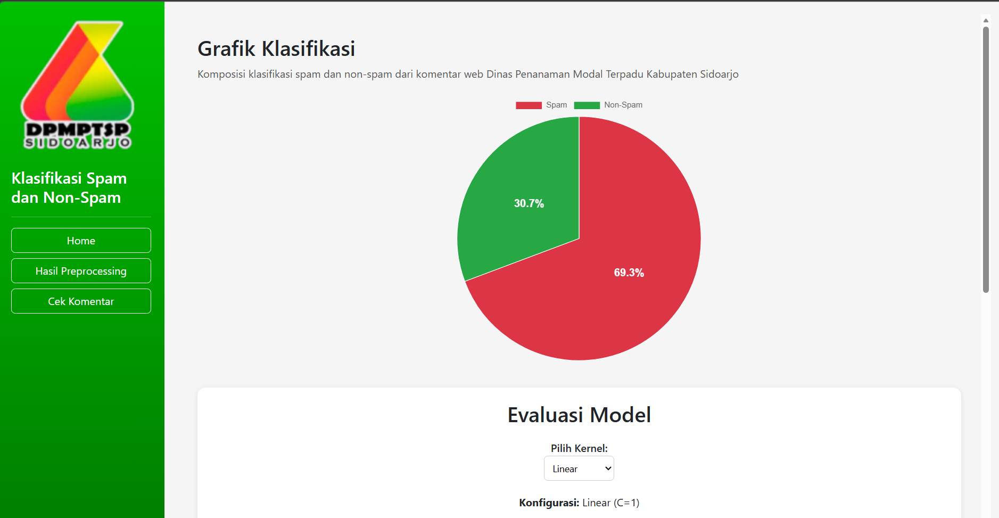
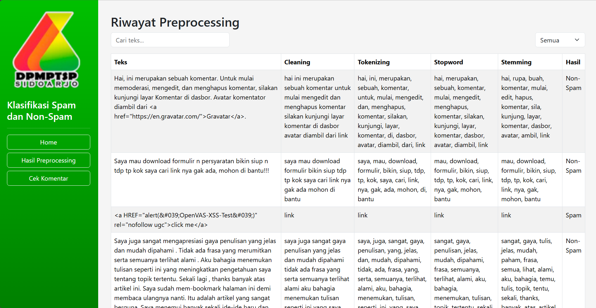
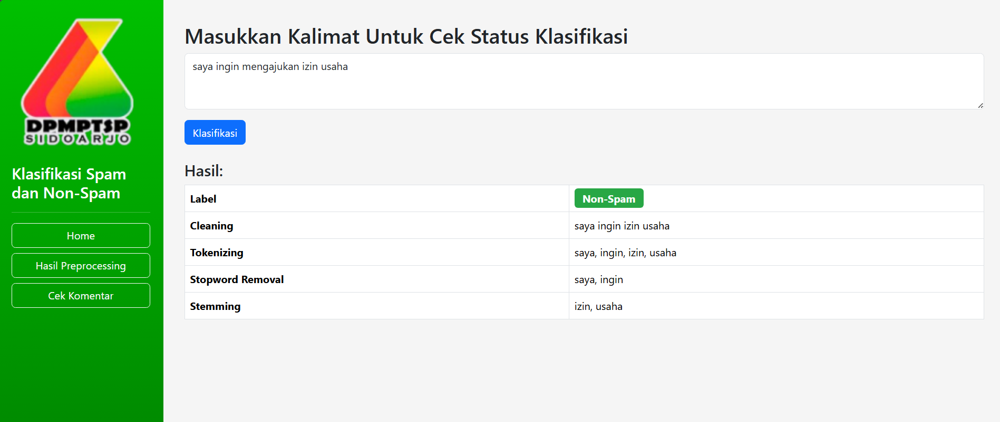

# 🎯 Spam Detection Application

Aplikasi web berbasis React untuk mendeteksi dan mengklasifikasikan komentar spam dan non-spam menggunakan metode **Support Vector Machine (SVM)** dengan berbagai jenis kernel. Aplikasi ini dikembangkan untuk menganalisis komentar dari website Dinas Penanaman Modal Terpadu Kabupaten Sidoarjo.

## Tampilan




## 📋 Fitur Utama

### 1. **Dashboard Home**
- 📊 Grafik Pie Chart yang menampilkan komposisi klasifikasi spam dan non-spam
- 📈 Tabel evaluasi metrik model untuk berbagai kernel SVM:
  - Linear Kernel (C=1)
  - RBF Kernel (C=1, gamma=1)
  - Polynomial Kernel (C=1, gamma=1, degree=3, coef0=0.1)
  - Sigmoid Kernel (C=1, coef0=0.1)
- ☁️ Visualisasi Word Cloud untuk kata-kata yang sering muncul di spam dan non-spam

### 2. **Cek Komentar**
- ✍️ Input teks komentar untuk diklasifikasi
- 🏷️ Prediksi klasifikasi (Spam/Non-Spam)
- 🔍 Tampilan lengkap proses preprocessing:
  - Cleaning
  - Tokenizing
  - Stopword Removal
  - Stemming

### 3. **Hasil Preprocessing**
- 📜 Riwayat klasifikasi komentar
- 🔎 Fitur pencarian berdasarkan teks
- 🎛️ Filter berdasarkan kategori (Semua/Spam/Non-Spam)
- 📄 Pagination untuk menampilkan data dalam jumlah besar

## 🛠️ Teknologi yang Digunakan

### Frontend
- **React 19.1.0** - Library JavaScript untuk membangun UI
- **React Router DOM 7.5.3** - Routing untuk navigasi antar halaman
- **React Bootstrap 2.10.9** - Komponen UI Bootstrap untuk React
- **Bootstrap 5.3.6** - Framework CSS untuk styling
- **Chart.js 4.4.9** - Library untuk membuat grafik
- **react-chartjs-2 5.3.0** - Wrapper Chart.js untuk React
- **chartjs-plugin-datalabels 2.2.0** - Plugin untuk menambahkan label pada grafik
- **Axios 1.9.0** - HTTP client untuk komunikasi dengan backend
- **D3.js 7.9.0** - Library untuk manipulasi dokumen berbasis data
- **Tippy.js 6.3.7** - Library untuk tooltip

### Backend
- Backend menggunakan Flask yang berjalan pada port 5000
- Endpoints yang digunakan:
  - `GET /stats` - Mendapatkan statistik spam dan non-spam
  - `POST /predict` - Melakukan prediksi klasifikasi
  - `GET /history` - Mendapatkan riwayat preprocessing

## 📁 Struktur Proyek

```
spam-app/
├── public/                    # Assets statis
│   ├── dpmptsp.png           # Logo Dinas Penanaman Modal
│   ├── wc_spam.png           # Word Cloud untuk spam
│   ├── wc_nonspam.png        # Word Cloud untuk non-spam
│   └── index.html            # File HTML utama
├── src/
│   ├── components/           # Komponen Reusable
│   │   ├── BarChart.js       # Komponen Bar Chart
│   │   ├── PieChart.js       # Komponen Pie Chart
│   │   └── Sidebar.js        # Komponen Sidebar navigasi
│   ├── pages/                # Halaman aplikasi
│   │   ├── Home.js           # Halaman Dashboard utama
│   │   ├── Home.css          # Styles untuk Home
│   │   ├── AddData.js        # Halaman Cek Komentar
│   │   ├── AddData.css       # Styles untuk AddData
│   │   ├── History.js        # Halaman Riwayat
│   │   └── History.css       # Styles untuk History
│   ├── api.js                # Konfigurasi Axios
│   ├── App.js                # Komponen utama dengan routing
│   ├── App.css               # Styles global
│   └── index.js              # Entry point React
└── package.json              # Dependencies dan scripts
```

## 🚀 Instalasi dan Menjalankan Proyek

### Prasyarat
Sebelum memulai, pastikan Anda telah menginstal:
- **Node.js** (v14 atau lebih tinggi)
- **npm** atau **yarn**
- **Backend Flask** yang berjalan pada `http://127.0.0.1:5000`

### Langkah-langkah Instalasi

1. **Clone atau download proyek ini**

2. **Install dependencies**
   ```bash
   npm install
   ```

3. **Konfigurasi Backend**

   Pastikan backend Flask Anda berjalan pada port 5000. Jika menggunakan port berbeda, ubah file [`src/api.js`](src/api.js):
   ```javascript
   const api = axios.create({
     baseURL: 'http://127.0.0.1:5000', // Ubah sesuai port backend Anda
   });
   ```

4. **Jalankan aplikasi dalam mode development**
   ```bash
   npm start
   ```

   Aplikasi akan terbuka di browser pada `http://localhost:3000`

5. **Build untuk produksi**
   ```bash
   npm run build
   ```

   Folder `build/` akan dibuat dan siap untuk di-deploy

## 📊 Metrik Evaluasi Model

Aplikasi ini menampilkan metrik evaluasi untuk setiap kernel SVM:

| Kernel | Akurasi | Precision | Recall | F1-Score |
|--------|---------|-----------|--------|----------|
| Linear | 98.27% | 0.98 | 0.98 | 0.98 |
| RBF | 98.62% | 0.99 | 0.98 | 0.98 |
| Polynomial | 98.62% | 0.99 | 0.98 | 0.98 |
| Sigmoid | 98.62% | 0.98 | 0.99 | 0.98 |

## 🎨 Navigasi Aplikasi

Aplikasi memiliki 3 halaman utama yang dapat diakses melalui sidebar:

1. **Home** (`/`) - Dashboard dengan statistik dan evaluasi model
2. **Hasil Preprocessing** (`/history`) - Riwayat klasifikasi dengan fitur filter dan pencarian
3. **Cek Komentar** (`/add`) - Form untuk input dan klasifikasi komentar baru

## 🔧 Konfigurasi

### Mengubah Port Backend

Edit file [`src/api.js`](src/api.js):

```javascript
import axios from 'axios';

const api = axios.create({
  baseURL: 'http://your-backend-url:port',
});

export default api;
```

### Mengubah jumlah item per halaman

Edit file [`src/pages/History.js`](src/pages/History.js):

```javascript
const itemsPerPage = 5; // Ubah angka ini
```

## 📝 API Endpoints

### Mendapatkan Statistik
```http
GET /stats
Response: {
  "spam": 123,
  "non_spam": 456
}
```

### Prediksi Klasifikasi
```http
POST /predict
Body: {
  "text": "isi komentar..."
}
Response: {
  "prediction": "1", // 1 untuk spam, 0 untuk non-spam
  "preprocessing": {
    "cleaned": "teks hasil cleaning",
    "tokens": ["token1", "token2"],
    "removed_stopwords": ["kata1", "kata2"],
    "stemmed": ["kata1", "kata2"]
  }
}
```

### Mendapatkan Riwayat
```http
GET /history
Response: [
  {
    "text": "teks asli",
    "cleaning": "hasil cleaning",
    "tokenizing": ["token1"],
    "stopword": ["token1"],
    "stemming": ["stem1"],
    "prediction": "1"
  }
]
```

## 🎯 Penggunaan

1. **Melihat Statistik**
   - Buka halaman Home untuk melihat grafik komposisi spam dan non-spam
   - Pilih kernel yang diinginkan untuk melihat metrik evaluasi

2. **Menambahkan Komentar Baru**
   - Buka halaman Cek Komentar
   - Masukkan teks komentar pada textarea
   - Klik tombol "Klasifikasi"
   - Lihat hasil prediksi dan proses preprocessing

3. **Melihat Riwayat**
   - Buka halaman Hasil Preprocessing
   - Gunakan filter untuk menampilkan hanya spam atau non-spam
   - Gunakan search untuk mencari teks tertentu
   - Navigasi halaman dengan tombol Prev/Next

## 🐛 Troubleshooting

### Masalah: Tidak bisa terhubung ke backend
**Solusi:**
- Pastikan backend Flask berjalan pada port 5000
- Cek konfigurasi di [`src/api.js`](src/api.js)
- Pastikan tidak ada firewall yang memblokir koneksi

### Masalah: Grafik tidak tampil
**Solusi:**
- Pastikan semua dependencies terinstall dengan benar
- Cek console browser untuk error message
- Pastikan file gambar word cloud ada di folder public

### Masalah: Styling berantakan
**Solusi:**
- Clear cache browser
- Hapus node_modules dan install ulang:
  ```bash
  rm -rf node_modules
  npm install
  ```


## 👨‍🎓 Tentang Proyek

Proyek ini dikembangkan sebagai bagian dari Skripsi dengan judul implementasi deteksi spam menggunakan metode Support Vector Machine (SVM) pada komentar web Dinas Penanaman Modal Terpadu Kabupaten Sidoarjo.

---

####
####

## Source Code Back-end Flask
https://github.com/Chucuyeah/spam-flask-backend